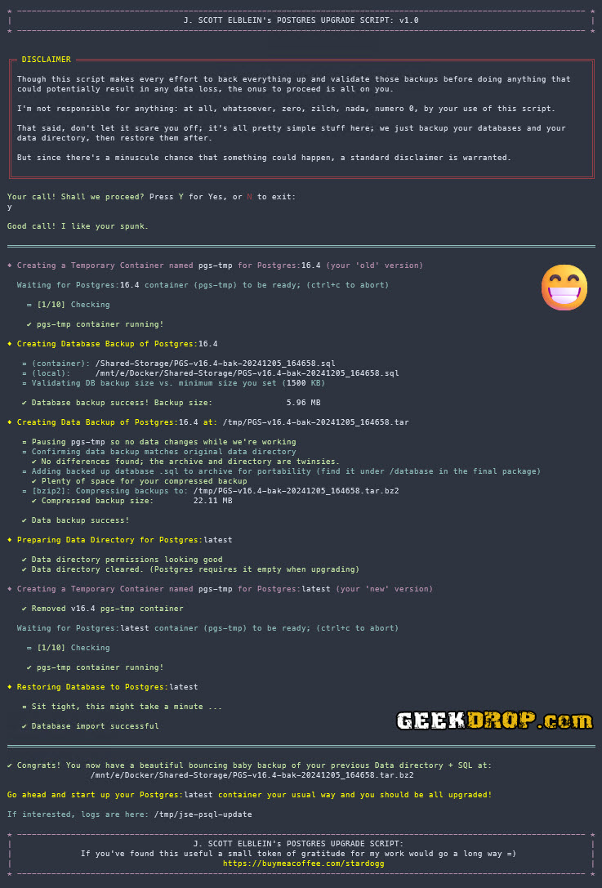

# JSE Postgres Update

Script to update an older Postgres version's data to a newer Postgres version.

Also, for example, you might get an error like this when starting your Postgres container:

> "The data directory was initialized by PostgreSQL version 16, which is not compatible with this version 17"

This will automate the data upgrade for you.
Note that this script is specifically created for [Postgres containers](https://hub.docker.com/_/postgres),
since that is what I use, but I would imagine with minor tweaks it could easily be made to work for native installations as well.

## What it Does

- Creates a temporary "old" version container (the current one with the data to upgrade).
- Backs up your database(s) on the "old" version server to a .sql file.
- Compares the backed up .sql size to a minimum size you've set in the script config.
- Backs up your Data directory into a .tar archive.
- Compares the Data directory with the archive to be sure it is identical.
- Copies the backed-up .sql file into the backed-up Data archive, so you have all backups in 1 place.
- Optionally compresses the archive with Gzip or Bzip2
- Moves the archive to your chosen final resting place for it.
- Prepares the Data directory for the upgrade; validates User, permissions, etc.
- Creates a temporary "new" version container (the one upgrading to).
- Imports/Restores the backed-up .sql into the new Postgres version.

Then cleans up after itself.

After that, all you need to do is start the new version as you normally would and it's all upgraded.

## Reason for Living

I've been using `postgres:latest` (in a container) since around version 13 and it seems that Postgres updates major versions surprisingly
often, killing all other containers that use a PGS database until I do these steps manually.
And personally, I've found having to stop everything, look up all the steps and remember the procedure, then do them
by hand a bit of a [PITA](https://www.urbandictionary.com/define.php?term=pita).

So I took some time out to write this to save me even more time in the future. Thus it was born.

So far this same procedure has worked for me through versions 13-17 without issue.

## How to Use

1. Clone this repo (or just grab the script itself)
2. Edit the options to match your setup (most of the defaults should be fine)
3. Run it. (It _must_ be run as root/sudo; it'll scold you if you try not to.)

   `sudo ./JSE-Postgres-Update.sh`

**Bout it!**

After it's done, you'll have a full backup of your SQL and Data, and the newer version of Postgres will have
all of your data migrated. Just fire the new version up as you always do, using the new version tag.

This is it's "hello world" release, so I'm sure I might've mist some edge cases, and such. If so let me know in the issues.

## Screenshot

